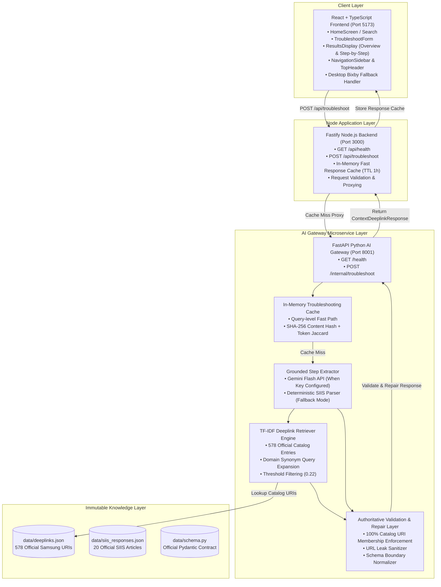

# System Architecture & Technical Specifications

> **Samsung PRISM Gen AI Hackathon 3.0 — Theme 2: Guided Troubleshooting**  
> Technical documentation for system architecture, data flow, and retrieval pipeline.

---

## 🏛️ System Architecture Diagram

---

## 🔍 Detailed Component Architecture

### 1. React + TypeScript Frontend (`frontend/`)
- **UI Framework**: React 18, TypeScript, Tailwind CSS, custom Vanilla CSS glassmorphism system.
- **Modes**:
  - **Overview Mode**: Comprehensive visualization of all diagnostic actions, repair steps, and deeplinks.
  - **Interactive Guided Mode**: Step-by-step repair walkthrough with progress bar, completion checkboxes, and active step focus.
- **Desktop Fallback**: Desktop web browsers cannot open Bixby protocol schemes (`bixby://`). The UI detects desktop environments and provides a clean *"Copy Settings Shortcut"* button alongside instructions.

### 2. Node.js Application Backend (`backend/`)
- **Framework**: Fastify 5.x with TypeScript (`ts-node`).
- **Response Caching**: In-memory Map (`responseCache`) storing pre-validated JSON responses. Guaranteed response time for warm cache hits is **`≤ 10ms`**.
- **Proxy & Validation**: Validates incoming request structure and forwards payload to Python AI Gateway via `fetch` with configurable timeout.

### 3. Python AI Gateway Microservice (`ai-gateway/`)
- **Framework**: FastAPI with Pydantic v2 data models matching `data/schema.py`.
- **Grounded Step Extractor**:
  - **Gemini Flash Mode**: When `GEMINI_API_KEY` is present, sends grounded prompt to Gemini Flash instructing it to extract 2–5 logical action groups strictly from SIIS text.
  - **Deterministic Fallback Mode**: When API key is absent or quota is exceeded, a regex-based SIIS parser extracts section headers and bullet/numbered steps to form valid `Action` and `StepGroup` structures.
- **TF-IDF Deeplink Retriever**:
  - Pre-indexes all 578 official entries from `data/deeplinks.json` using `description + message + qna_description + originalType`.
  - Computes TF-IDF vectors using custom pure-Python mathematical routines (zero external ML dependencies).
  - Enriches queries using a domain-specific synonym expansion map (`_DOMAIN_EXPANSIONS`) to improve retrieval recall.
- **Validation & Repair Layer (`validator.py`)**:
  - Verifies that **every** returned actionable or validation deeplink exists in the 578-entry catalog. If unindexed, replaces URI with official catalog fallback (`bixby://settings/main`).
  - Strips any external HTTP/HTTPS/WWW URLs using regular expressions to prevent URL leakage.
  - Normalizes scores within `[0.0, 1.0]` and validates title/goal formatting.

### 4. Immutable Data Layer (`data/`)
- **`deeplinks.json`**: 578 official Samsung device settings and validation deeplinks.
- **`siis_responses.json`**: 20 official benchmark test cases containing SIIS articles.
- **`schema.py`**: Pydantic schema definition defining `ContextDeeplinkResponse`, `Goal`, `Action`, `StepGroup`, `Deeplink`, and `ValidationDeepLink`.

---

## 🔄 End-to-End Execution & Data Flow

1. **User Query Input**: User enters complaint (e.g., *"Wi-Fi keeps disconnecting randomly"*).
2. **Backend Proxy Check**: Fastify checks `responseCache`. On cache hit, returns JSON in `< 10ms`.
3. **SIIS Knowledge Resolution**: AI Gateway receives query. If SIIS payload is not explicitly attached, `SIISArticleRetriever` searches `data/siis_responses.json` via TF-IDF to find the matching SIIS knowledge article.
4. **Step Extraction**: Grounded Extractor parses article into structured diagnostic action groups.
5. **Deeplink Matching**: Step descriptions are queried against `DeeplinkRetriever`. Best catalog match above `threshold=0.22` is assigned to `actionableDeeplink` and `validationDeeplink`.
6. **Validation & Repair**: Response passes through `validate_and_repair_response` to ensure 100% catalog membership and 0 URL leaks.
7. **Response Presentation**: React UI renders interactive diagnostic card with Bixby deeplink buttons and step progress tracker.
